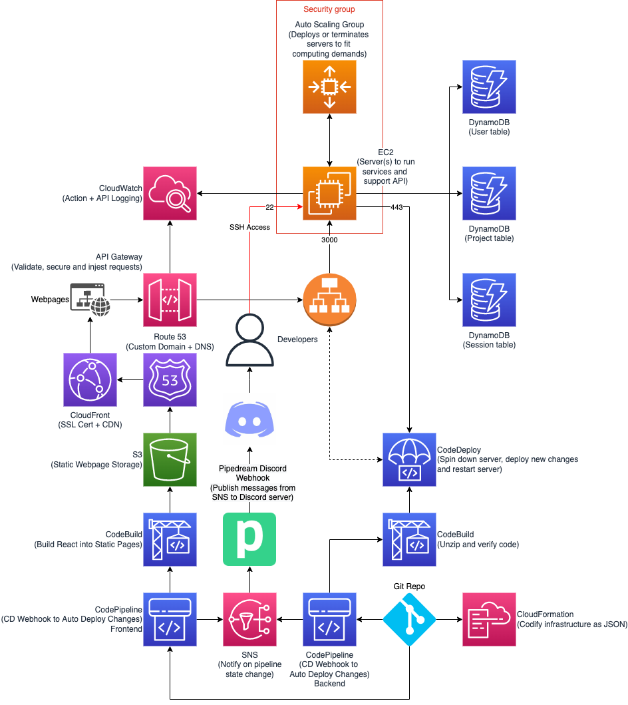

# bidOS Docs

### Development Pipeline

### Stack Info

CloudFormation template used to deploy our servers is based on a template referenced in resource #5 (see below).

### Resources
 1. [AppSpec File example - AWS CodeDeploy](https://docs.aws.amazon.com/codedeploy/latest/userguide/reference-appspec-file-example.html)
 1. [CodeDeploy AppSpec File reference - AWS CodeDeploy](https://docs.aws.amazon.com/codedeploy/latest/userguide/reference-appspec-file.html#appspec-reference-server)
 1. [Add an application specification file to a revision for CodeDeploy - AWS CodeDeploy](https://docs.aws.amazon.com/codedeploy/latest/userguide/application-revisions-appspec-file.html#add-appspec-file-server)
 1. [Create an application for an in-place deployment (console) - AWS CodeDeploy](https://docs.aws.amazon.com/codedeploy/latest/userguide/applications-create-in-place.html)
 1. [Create an Amazon EC2 instance for CodeDeploy (AWS CloudFormation template) - AWS CodeDeploy](https://docs.aws.amazon.com/codedeploy/latest/userguide/instances-ec2-create-cloudformation-template.html)